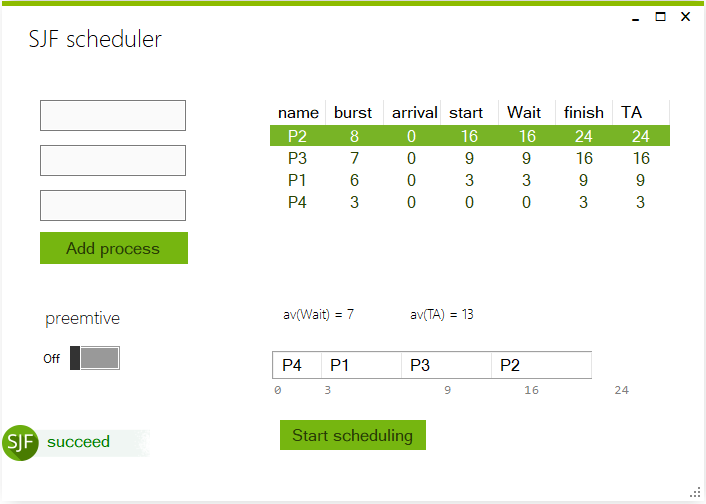
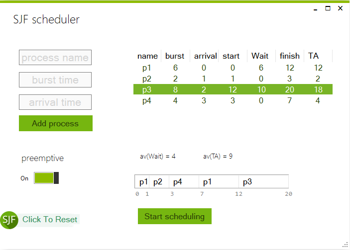
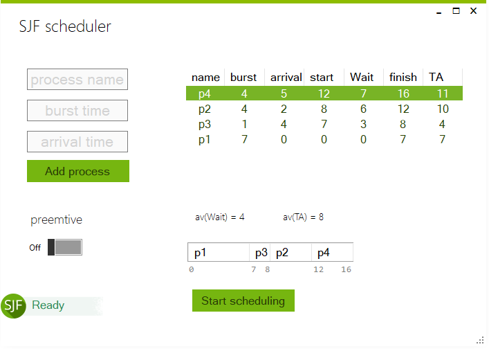
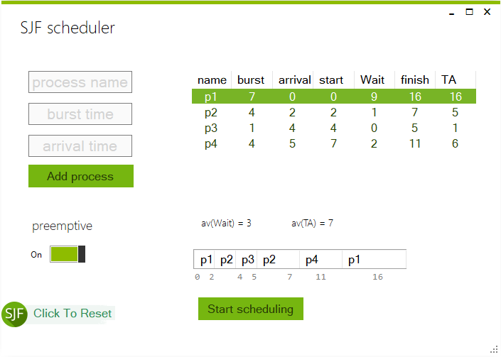

# Simulator of CPU Scheduling Shortest Job First Algorithm (non-preemptive/preemptive)

### Dependencies
- .NET Framework 4.5.2
- UI Theme [MetroFramework](https://github.com/thielj/MetroFramework)
## Results

| Shortest Job First (non-preemptive) | Shortest Remaining Time First (preemptive)|
|-----|-----|
|  |  |
|  |  |

### References
- [CS211P - Operating Systems Course - Department of Computer science - Faculty of Computers and Information Sciences - Mansoura University](http://csifac.mans.edu.eg/images/files/course-specification/2/2-Operating_system1-.pdf) 
- [Silberschatz, Galvin and Gagne, Operating system concepts. John Wiley and Sons. 9th edition.](http://www.os-book.com/)